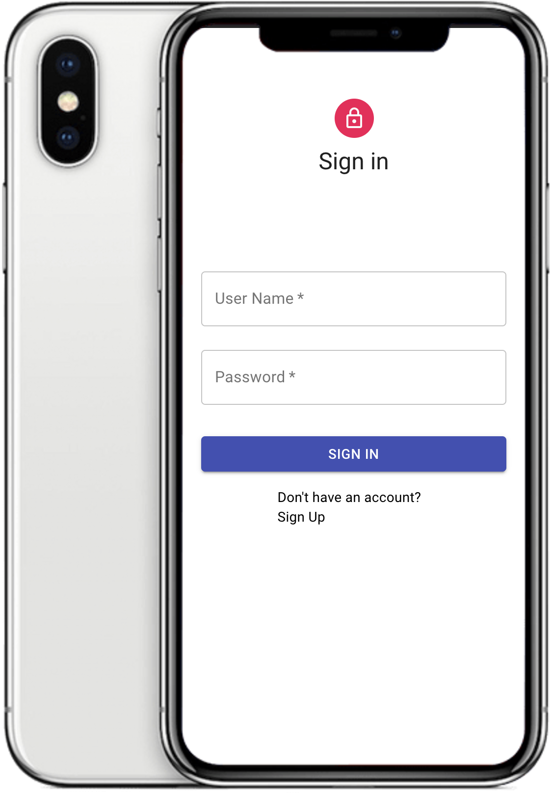
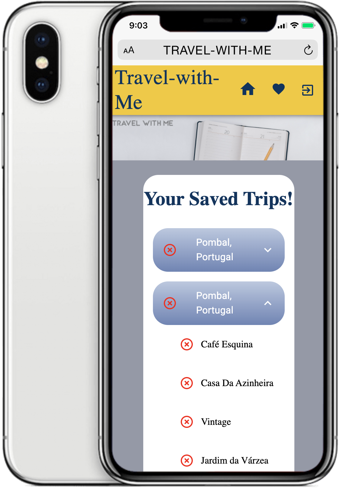
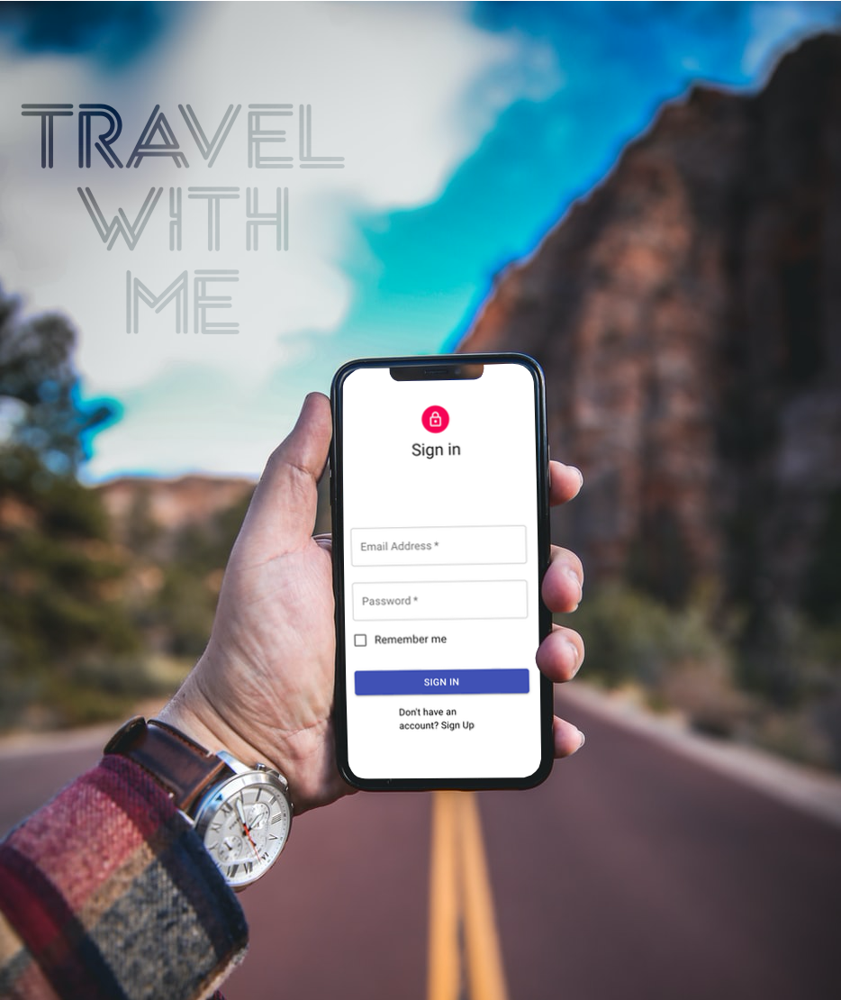

# Travel Planner-Tour The World


## Project Description

Travel Planner is a full-stack web application designed to simplify trip planning and management. It empowers users to create, organize, and share detailed travel itineraries, collaborate with fellow travelers, explore and bookmark points of interest, and enhance their overall travel experiences.

<br />

<br />

<br />

<br />

<br />


## Purpose

The purpose of this project is to provide travelers with a user-friendly platform to plan and document their trips efficiently. Whether you're a solo traveler or part of a group, Travel Planner aims to streamline the trip planning process, making it easier to create and execute memorable adventures.


## Key Features

- User authentication and authorization with Passport.js
- Create and manage detailed travel itineraries
- Collaborate with others on trip planning
- Explore and bookmark points of interest
- Securely hash and store user passwords with Bcrypt
- Intuitive and responsive Material UI design


## Learning Objectives

- Gain hands-on experience with full-stack development
- Implement user authentication and authorization
- Work with a NoSQL database (MongoDB) and Mongoose
- Create interactive user interfaces with React and AJAX
- Enhance security with password hashing (Bcrypt)
- Design a responsive and visually appealing UI with Material UI


## User Stories

- As a traveler, I want to sign up and log in to my account securely.
- As a user, I want to create, edit, and delete travel itineraries.
- As a traveler, I want to collaborate with friends on trip planning.
- As a user, I want to discover and save points of interest.
- As a traveler, I want to access my travel plans from any device.


## Installation

To run this project locally, follow these steps:

1. Clone the repository:

   ```bash
   git clone https://github.com/your-username/travel-planner.git

    Install the project dependencies:

    bash

cd travel-planner
npm install

Set up your MongoDB database and update the connection string in the configuration.

Start the development server:

bash

    npm start


Live Demo

Check out the live demo of Travel Planner here.
Hosting


Travel Planner is hosted on Hosting Provider Name.


Author

    Your Name: SALOME BASSEY
    GitHub:https://github.com/lomsey41 
    Twitter:http://www.twitter.com/lomsey41 
    LinkedIn:http://www.linkedin.com/in/salome-bassey 


LICENSE:

This project is licensed under the MIT License.


Acknowledgments

    Special thanks to [NATHANIEL EMENIKE] for his Technical Support
